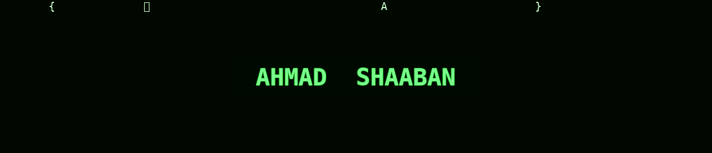

<!-- ═══════════════════════ MATRIX BANNER ═══════════════════════ -->
<!-- Animated GIF banner (self-hosted: assets/matrix.gif). GitHub strips CSS/JS,
     so real animation is delivered as a GIF. -->

  

---

<!-- ═══════════════════════ NAME + SPECIALIZATIONS + CONTACT ═══════════════════════ -->
<h1 align="center">Ahmad Shaaban</h1>

  

📍 Aleppo, Syria · 🌍 Open to relocation

  
  
  
  
  

---

### 🧠 About Me

IT Engineering graduate (Networks & Security, University of Aleppo, 2026), specializing in **Web Application Security** and **Vulnerability Assessment**, with a focus on **offensive security** and **Binary Exploitation**. Hands-on experience across penetration testing, system administration, security automation, and data analysis.

📂 **pwn-journey** → documented binary-exploitation labs, code, and write-ups: [github.com/soul-taker-55/pwn-journey](https://github.com/soul-taker-55/pwn-journey)

---

### 🛠️ Technical Skills

| Domain | Stack |
|:------|:------|
| **🔐 Cybersecurity** |       |
| **🧪 Pentesting Tools** |      |
| **🔬 Binary Exploitation** |      |
| **🖥️ Systems & Infra** |      |
| **⚙️ Automation** |     |
| **📊 Data Analytics** |   |
| **💻 Programming** |       |

---

### 🌍 Languages

  
  
  

---

### 📊 GitHub Stats

  

---

<i>"The best way to learn security is to build something, then break it."</i>
